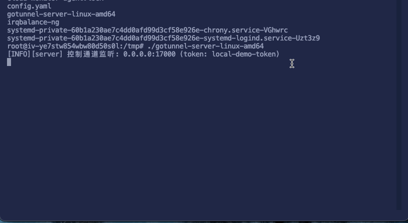

# gotunnel

[](https://github.com/vanyongqi/gotunnel/actions)
[](https://codecov.io/gh/vanyongqi/gotunnel)
[](https://goreportcard.com/report/github.com/vanyongqi/gotunnel)
[](https://golang.org)
[](LICENSE)
[](https://github.com/vanyongqi/gotunnel/releases)
[](https://github.com/vanyongqi/gotunnel)

---

<p align="center">
  
</p>

## 🚀 Introduction

**gotunnel** is a high-performance, secure, and easy-to-use intranet penetration (Tunnel/Proxy) tool written in Go. 
Heavily inspired by [frp](https://github.com/fatedier/frp) and [ngrok](https://github.com/inconshreveable/ngrok). 
It enables safe remote access and management of internal network services via a cloud relay server. Supports HTTP, TCP, SSH and more.

<div align="center">
  <table>
    <tr>
      <td align="center" style="vertical-align:middle;">
        <div style="width:400px;height:270px;overflow:hidden;display:flex;justify-content:center;align-items:center;background:#f2f2f2;border-radius:8px;">
          <br /><br />
          
        </div>
        <div style="font-size:16px; margin-top:8px;"><br />HTTP Demo</div>
      </td>
      <td align="center" style="vertical-align:middle;">
        <div style="width:400px;height:270px;overflow:hidden;display:flex;justify-content:center;align-items:center;background:#f2f2f2;border-radius:8px;">
          
        </div>
        <div style="font-size:16px; margin-top:8px;">SSH Demo</div>
      </td>
    </tr>
  </table>
</div>

---


---

## 🌟 Features
- ⚡ Simple deployment, minimal configuration, fast relay
- 🔒 Secure token-based authentication for all traffic
- 🔁 Heartbeat & health check, auto online/offline
- 🏷️ Multi-port & multi-client, support clustered mappings
- 🔧 Flexible config, easy YAML manage
- 📝 English/Chinese i18n logs, friendly debugging
- 🖥️ Cross-platform build: Linux, Mac, Windows (x64)
- 📦 GitHub Actions one-click Release (see workflows)

---
## 📦 Quick Start

### 1. [Download Release](https://github.com/vanyongqi/gotunnel/releases)（or build locally）

### 2. Start Your HTTP/SSH Service Locally
```bash
# HTTP Example (localhost:3111):
python3 -m http.server 3111
# SSH (default port 22, enable on Mac)
sudo systemsetup -setremotelogin on
```

### 3. Config Sample
See [`config_template.yaml`](config_template.yaml):
```yaml
server:
  addr: "0.0.0.0:17000"
  token: "your-token"
client:
  name: "myclient"
  token: "your-token"
  server_addr: "your-server-ip:17000"
  local_ports: [3111]         # <== Your local service port
  remote_port: 18080          # <== Public access port
```

### 4. Run
```bash
./gotunnel-server  # On remote/cloud server
./gotunnel-client  # On your local machine
```

---
## 🖥️ Architecture

```
[ User ] <---> [Cloud Server: gotunnel-server] <--tunnel--> [LAN Client: gotunnel-client] --> [Local Service]
```

---
## 📺 Showcase

- **HTTP Demo:** see GIF above
- **SSH Proxy:** see GIF above
- **More examples:** [`example/`](example/) and [`local_demo/`](local_demo/)

---
## ⬆️ CI/CD & Release

- Supports manual one-click release action via Github Actions: cross-platform build and auto-upload assets ([release.yml](.github/workflows/release.yml))
- Download latest binary & assets from [Releases](https://github.com/vanyongqi/gotunnel/releases)

---
## 📖 Documentation

- [Quick Start](doc/01-QUICKSTART.md)
- [Configuration Guide](doc/zh/02-CONFIG.md)
- [Protocols](doc/zh/04-PROTOCOL.md)
- [Bugfixes](doc/zh/09-BUGFIXES.md) / [Bugfixes EN](doc/en/09-BUGFIXES.md)
- See [`doc/`](doc/) for more.

---
## 🙌 Contributing

Pull requests, issues and feature suggestions are welcome!

---
## 💼 License

MIT © 2023-2025 Richard & Contributors

---
## ⭐ Acknowledgements
Inspired by frp, ngrok, contributors and users.
